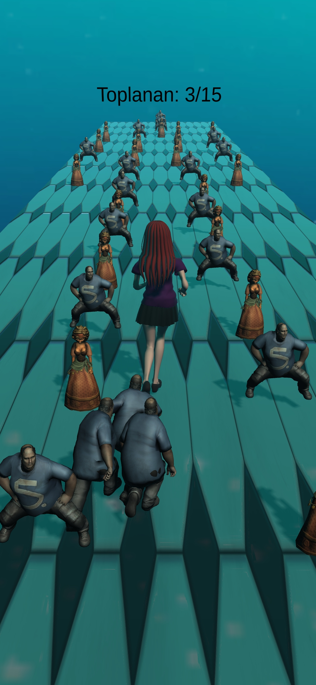
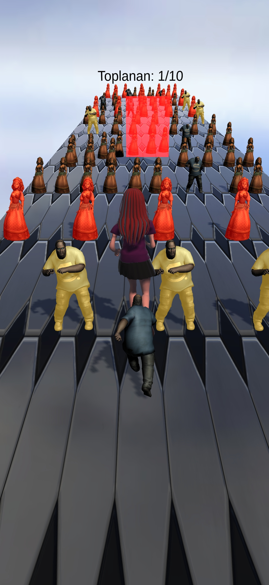
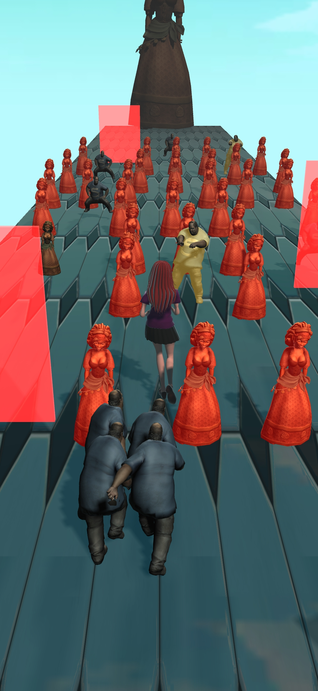
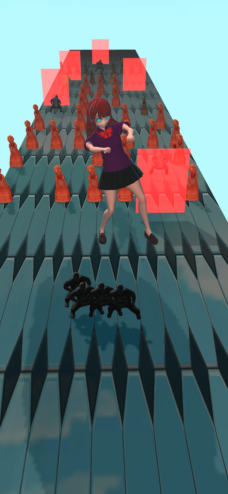
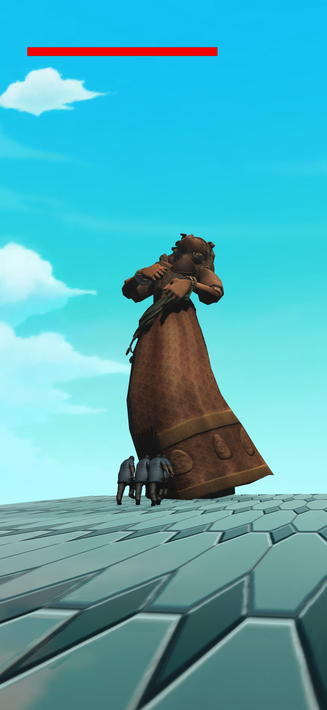

# GothRun Mobile Hypercasual Game

Welcome to the GothRun! GothRun is a hypercasual mobile game developed by myself. I improved my C#, Object Oriented Programming and Unity knowledge with this game. 

This README file provides detailed information about the game, including gameplay mechanics, level design, and instructions for building and running the project. The game is developed using Unity and the repository includes both the Unity project files and the APK for installation.

## Table of Contents
1. [Game Overview](#game-overview)
2. [Gameplay Mechanics](#gameplay-mechanics)
3. [Levels](#levels)
4. [Boss Fight](#boss-fight)
5. [Installation](#installation)
6. [Building the Project](#building-the-project)
7. [Screenshots](#screenshots)
8. [License](#license)

## Game Overview

GothRun is a mobile game where the player controls a gothic girl character who collects "simps" while navigating through various levels. The objective is to gather a required number of simps by the end of each level to progress. Avoid obstacles and enemies to maintain your simp count, and face the final boss in the third level to win the game.

## Gameplay Mechanics

- **Character Control**: Use touch controls to move the gothic girl left or right.
- **simp Collection**: 
  - **Normal simps**: Collecting a normal simp adds 1 simp to your following group.
  - **Super simps**: Collecting a yellow super simp adds 2 simps to your following group.
- **Obstacles**: 
  - **Women**: Colliding with a woman reduces your simp count by 1.
  - **Super Women**: Colliding with a red super woman reduces your simp count by 2.
  - **Red Wall**: If you hit the red wall, you will slow down a lot!

## Levels

The game consists of three levels. Each level has a required simp count that the player must reach to progress to the next level.

- **Level 1**: Introduction to the basic mechanics. Collect enough simps to proceed.
- **Level 2**: Increased difficulty with more obstacles and a higher required simp count.
- **Level 3**: Final level with the boss fight. Collect the required simps to challenge the boss.

## Boss Fight

The boss fight occurs at the end of level 3. The boss is a larger version of the women you encounter in the levels.

- **Boss Mechanics**:
  - The boss has a health bar.
  - Your simps will attack the boss, reducing its health.
  - If the boss's health is depleted, the boss is defeated, and you win the game.
  - If you fail to collect enough simps, the boss will laugh at you, and you will lose the game.

## Installation

To install the game on your Android device:

1. Download the APK file from the repository.
2. Transfer the APK file to your Android device.
3. Open the APK file on your device and follow the installation instructions.

## Building the Project

To build the project from source:

1. Clone the repository to your local machine.
    ```bash
    git clone https://github.com/200202087/gothrun-mobile-hypercasual-game.git
    ```
2. Open the project in Unity.
3. Ensure you have the correct build settings for your target platform (Android).
4. Build the project by selecting `File > Build Settings` and then `Build`.
**Note: Make sure you build the project at 60 fps!**

## Screenshots

**First Level**



**Second Level**



**Third Level**



**We flex to the boss with the simps we collect ^^**



**Our simps attacking the boss for us!**



## License

This project is licensed under the MIT License. See the LICENSE file for more details.

---

Thank you for playing GothRun!
